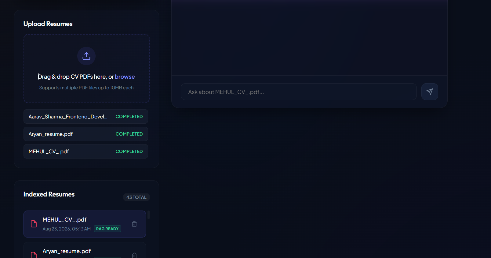
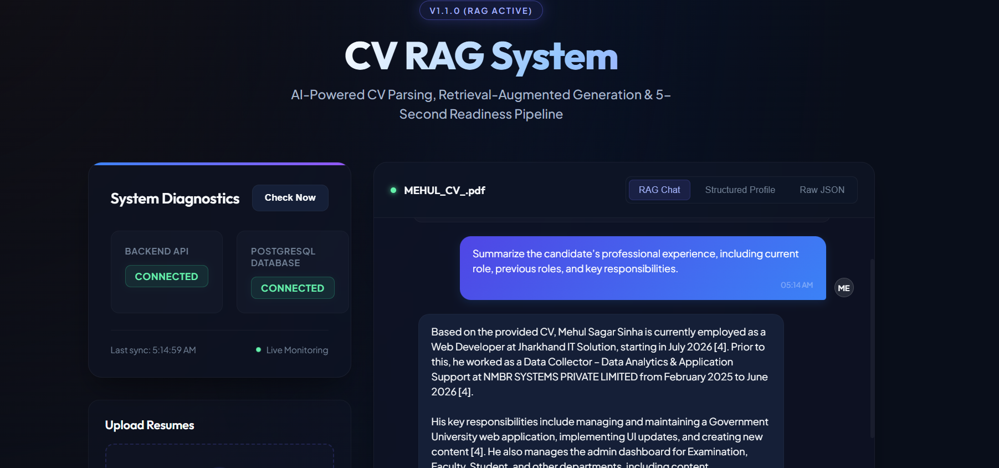
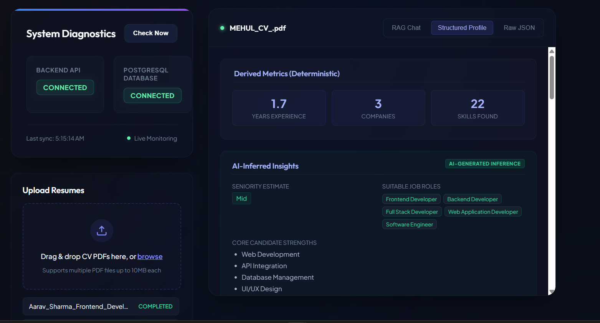
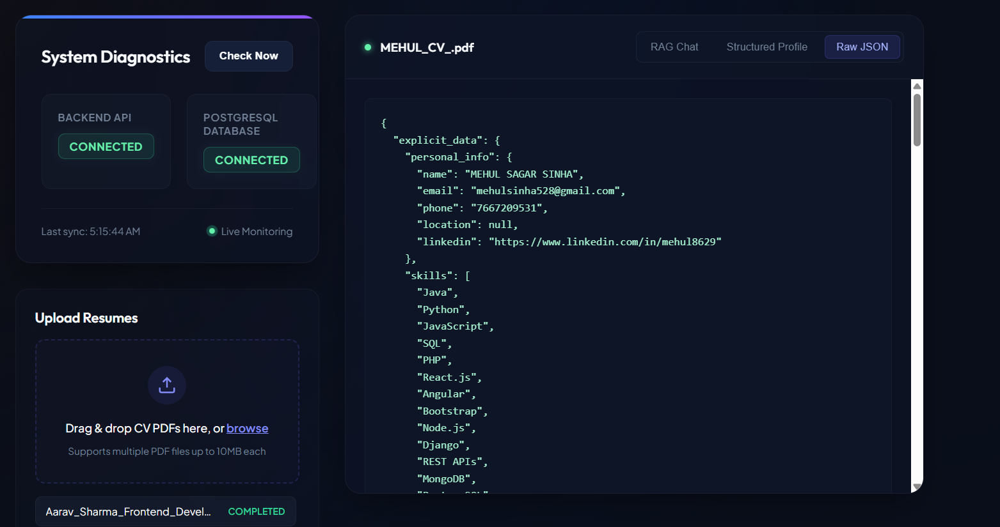
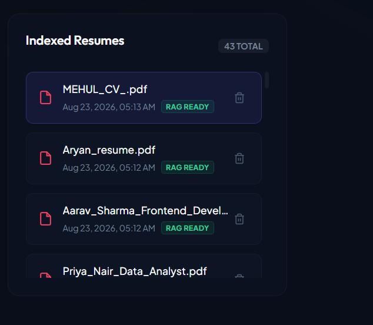
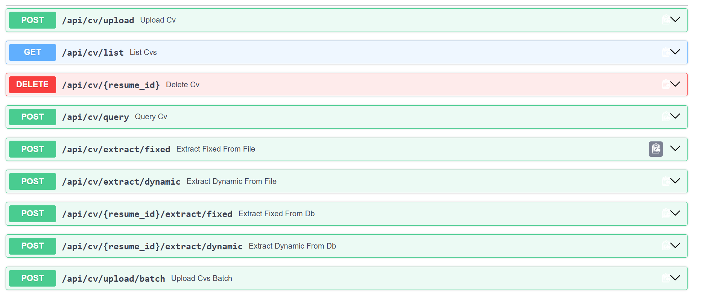
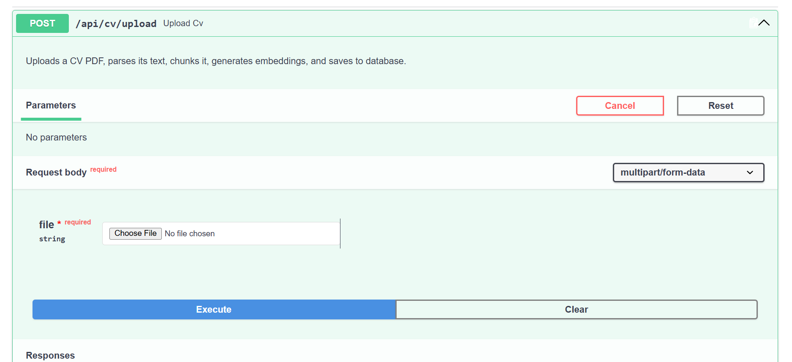
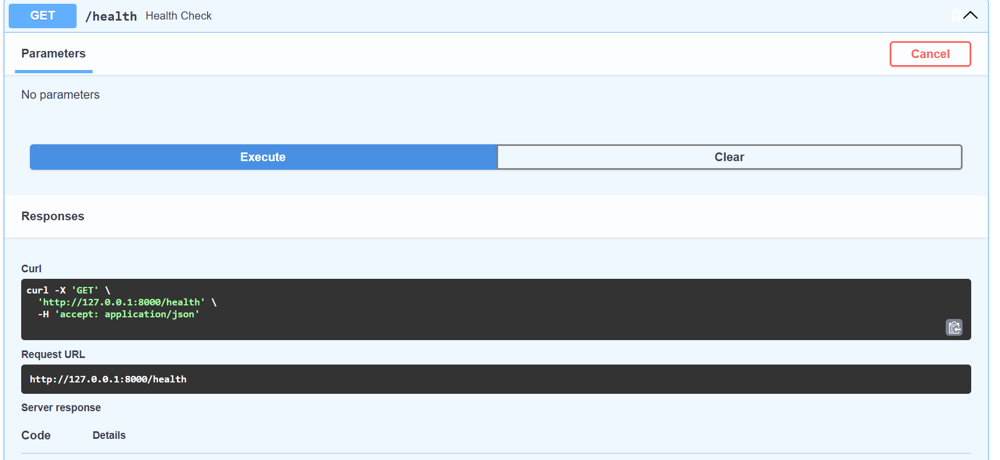
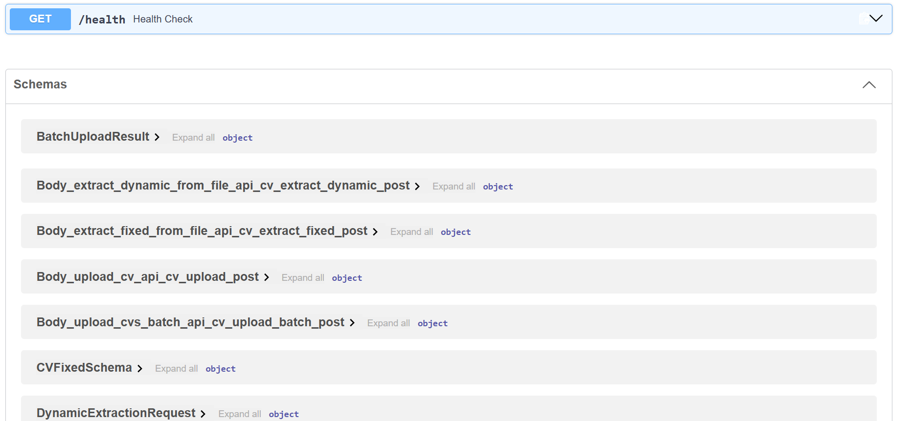

# CV RAG System

An AI-powered CV/resume analysis, Retrieval-Augmented Generation (RAG) chat, and structured JSON extraction system. This application allows recruiters and hiring managers to upload PDF resumes, parse and index them, and conduct interactive context-backed Q&A chat sessions or extract structured candidate information using the serverless Hugging Face provider running the state-of-the-art **Gemma 3 4B Instruct** model.

---

## 🚀 Live Deployed URLs

*   **Production Frontend (Vercel)**: [https://cv-rag-system.vercel.app](https://cv-rag-system.vercel.app)
*   **Production Backend API (Railway)**: [https://cv-rag-system-production.up.railway.app](https://cv-rag-system-production.up.railway.app)
*   **Swagger API Documentation**: [https://cv-rag-system-production.up.railway.app/docs](https://cv-rag-system-production.up.railway.app/docs)

---


## 1. Project Overview & Purpose

The CV RAG System simplifies candidate screening and structured resume parsing. During recruitment, parsing unstructured resume data into reliable profiles can be slow and prone to errors.

This project implements a fully hosted production RAG and extraction pipeline:
1. **Document Ingestion & Ingest Tracking**: Uploads PDF CVs/resumes (single or batch) and cycles through database processing states (`queued` $\rightarrow$ `parsing` $\rightarrow$ `extracting` $\rightarrow$ `indexing` $\rightarrow$ `rag_ready` or `failed`).
2. **PDF Parsing**: Extracts raw text from PDF CVs/resumes using the `pypdf` parsing library directly from file bytes.
3. **Text Chunking**: Segmenting text into semantic, overlapping blocks (800-character windows, 150-character overlap).
4. **Cloud Vectorization**: Generates vector embeddings using the **Serverless Self-Hosted GPU Endpoint** running the `BAAI/bge-small-en-v1.5` model.
5. **Vector Storage**: Indexes and stores embeddings directly in a PostgreSQL database (Neon DB) as JSON arrays.
6. **Contextual Retrieval**: Computes dimension-agnostic cosine similarity in Python to rank CV chunks.
7. **Structured Parsing**: Uses the **Serverless Self-Hosted GPU Endpoint** running **Gemma 3 4B Instruct** to perform JSON extraction (fixed schemas and dynamic keys).
8. **RAG Q&A**: Queries **Gemma 3 4B Instruct** to generate professional context-bounded answers with citations.

### Serverless Self-Hosted GPU Endpoint Justification

The project integrates with **Hugging Face Serverless Self-Hosted GPU Endpoints** (via Hugging Face Inference Endpoints or OpenAI-compatible custom container endpoints like vLLM) for both LLM completions and embeddings generation. This configuration satisfies the requirements:
- **No Provider Inference API Dependency**: Unlike shared API services with strict usage limits and data privacy concerns, dedicated serverless GPU endpoints give the system full control over dedicated GPU instances, compute scale, and data security.
- **On-Demand Auto-Scaling**: The GPU endpoints spin up and auto-scale down dynamically based on ingestion load, meaning zero idle compute cost.
- **Unified Authentication**: Uses standard Bearer token authentication via the `HF_TOKEN` environment variable.

---

## 2. Features

*   **Single and Batch PDF CV Upload**: Drag and drop one or multiple resume files. The system processes each CV inside nested transaction savepoints so individual failures do not block the batch queue.
*   **PDF Text Parsing (`pypdf`)**: Direct text extraction from file bytes without needing intermediate disk writes.
*   **Vector Chunking and Embeddings**: Text chunking with 800-character windows and 150-character overlap, paired with serverless `BAAI/bge-small-en-v1.5` embeddings.
*   **RAG Chat with Citations**: Context-bounded chat completions showing source citation tooltips containing filename, chunk index, and snippet previews.
*   **Gemma 3 4B Instruct Integration**: Serverless completions for RAG answers, structural extraction, and corrective retry iterations.
*   **JSON Validation and Retry/Correction Loop**: Validation against Pydantic schemas. Invalid outputs are automatically sent back to the LLM with repair prompts up to 2 times.
*   **Explicit, Derived, and Inferred Extraction**:
    *   *Explicit*: Personal info, education, skills, and work history.
    *   *Derived*: Date calculations (years of experience, gap detections, company counts) computed deterministically in Python.
    *   *Inferred*: AI-deduced insights (suitability tags, seniority tier, core strengths) marked with clear warnings.
*   **Structured PostgreSQL Storage/Cache**: Structured extraction results are saved in the `extracted_data` JSON column in PostgreSQL, avoiding redundant LLM costs on page loads.
*   **Real Backend Ingestion Status**: Real-time status reporting (`queued` $\rightarrow$ `parsing` $\rightarrow$ `extracting` $\rightarrow$ `indexing` $\rightarrow$ `rag_ready` or `failed`).
*   **Request/Trace IDs & Stage Timing**: Every Ingestion has a unique trace UUID and records durations for parsing, extraction, embedding, verification, and total times.
*   **Post-Indexing RAG-Ready Verification**: Automatically queries the vector index post-indexing to ensure chunks are searchable before promoting status to `rag_ready`.
*   **Resume Listing and Deletion**: Delete CV records along with all associated chunk vector embeddings.
*   **System Health & Diagnostics**: Live REST checks for server status and database connectivity.

---

## 3. Technology Stack

*   **Backend**: Python 3.11+, FastAPI, Pydantic v2, SQLAlchemy 2.0 (asyncpg driver)
*   **Frontend**: React 18, TypeScript, Vite, Vanilla CSS HSL tokens (TailwindCSS not used)
*   **Database**: PostgreSQL 16 (Neon DB in production)
*   **LLM Inference (Chat & Extraction)**: Hugging Face Serverless Self-Hosted GPU Endpoint (`google/gemma-3-4b-it`)
*   **Embedding Engine**: Hugging Face Serverless Self-Hosted GPU Endpoint (`BAAI/bge-small-en-v1.5`)
*   **PDF Parser**: `pypdf`
*   **Orchestration**: Docker, Docker Compose

---

## 4. System Architecture

The following diagram maps the production deployment data flow throughout the application:

```
        User
          ↓
   Vercel Frontend
          ↓
Railway FastAPI Backend
          ↓
Hosted GPU / LLM and Embedding Endpoint (Hugging Face)
          ↓
  PostgreSQL Database (Neon DB)
```

---

## 5. Project Structure

```
cv-rag-system/
├── backend/
│   ├── app/
│   │   ├── api/
│   │   │   ├── cv.py
│   │   │   └── health.py
│   │   ├── core/
│   │   │   ├── config.py
│   │   │   └── database.py
│   │   ├── models/
│   │   │   └── resume.py
│   │   ├── schemas/
│   │   │   └── cv_schema.py
│   │   ├── services/
│   │   │   ├── embeddings.py
│   │   │   ├── extractor.py
│   │   │   ├── openai_service.py
│   │   │   └── pdf_parser.py
│   │   └── main.py
│   ├── Dockerfile
│   └── requirements.txt
├── frontend/
│   ├── src/
│   │   ├── components/
│   │   │   ├── CVChat.tsx
│   │   │   ├── CVList.tsx
│   │   │   ├── CVUpload.tsx
│   │   │   └── HealthStatus.tsx
│   │   ├── pages/
│   │   │   └── Home.tsx
│   │   ├── index.css
│   │   └── main.tsx
│   ├── Dockerfile
│   └── package.json
└── docker-compose.yml
```

---

## 6. Setup & Running Instructions

The system is configured to run fully in production with zero local dependencies. For local development and testing, you can run the stack using Docker Compose and optionally run a local embedding model via Ollama.

### 1. Production Environment Configuration

In production, all services are hosted (Vercel, Railway, Neon DB, and Hugging Face GPU Endpoints). To configure the production environment, set the following environment variables in your hosting provider (e.g. Railway):

*   **`DATABASE_URL`**: Your async PostgreSQL connection string (`postgresql+asyncpg://...`).
*   **`HF_TOKEN`**: Your Hugging Face User Access Token (used as the default fallback for all serverless self-hosted GPU endpoint queries).
*   **`CORS_ORIGINS`**: A JSON list of permitted origins, e.g., `["https://cv-rag-system.vercel.app"]`.

---

### 2. Optional Local Development & Testing

Follow these steps to run the complete environment locally on your machine.

#### Prerequisites
*   [Docker Desktop](https://www.docker.com/products/docker-desktop/) installed and running.
*   *(Optional)* [Ollama](https://ollama.com/) installed if you wish to run embeddings locally using `nomic-embed-text` instead of the Hugging Face GPU Endpoints.

#### Step 1: Set Up Optional Local Embedding Model (Ollama)
If you wish to test local embeddings generation, pull the nomic embeddings model:
```bash
ollama pull nomic-embed-text
```

#### Step 2: Configure Local Environment Variables
Create a `.env` file in the `backend/` folder by copying `backend/.env.example`:
```bash
cp backend/.env.example backend/.env
```

Edit `backend/.env` with your settings (placeholders below, do not commit actual secrets):
```env
PROJECT_NAME="CV RAG System API"
APP_ENV=development
DEBUG=true

POSTGRES_USER=postgres
POSTGRES_PASSWORD=postgres
POSTGRES_DB=cv_rag
POSTGRES_HOST=db
POSTGRES_PORT=5432
DATABASE_URL=postgresql+asyncpg://postgres:postgres@db:5432/cv_rag

# Unified Hugging Face Token Fallback (for LLM and Cloud Embeddings)
HF_TOKEN=your_hugging_face_token_here
HF_MODEL=google/gemma-3-4b-it

# Specific API Keys (Optional, falls back to HF_TOKEN if empty)
GPU_API_KEY=
CLOUD_EMBEDDING_KEY=

# Local Ollama Configuration (Only used if testing local embedding generation)
OLLAMA_BASE_URL=http://host.docker.internal:11434/v1
OLLAMA_EMBEDDING_MODEL=nomic-embed-text
```

#### Step 3: Run the Application locally
From the repository root, build and start all containers:
```bash
docker compose up -d --build
```

#### Step 4: Access the Local Services
*   **Web Frontend Interface**: `http://localhost:5173`
*   **FastAPI REST API**: `http://localhost:8000`
*   **Swagger API Docs**: `http://localhost:8000/docs`

---

## 7. API Reference Docs

| Method | Endpoint | Description |
| :--- | :--- | :--- |
| **GET** | `/health` | Server health and database connection check. |
| **POST** | `/api/cv/upload` | Upload a single CV PDF, run inline extraction, and index. |
| **POST** | `/api/cv/upload/batch` | Upload multiple CVs in a batch queue. |
| **GET** | `/api/cv/list` | Fetch all indexed CVs with status and timing metadata. |
| **DELETE** | `/api/cv/{resume_id}` | Deletes a CV and its chunks from PostgreSQL. |
| **POST** | `/api/cv/query` | RAG-based context Q&A query with citation references. |
| **POST** | `/api/cv/extract/fixed` | Parse direct PDF bytes to fixed template JSON. |
| **POST** | `/api/cv/extract/dynamic` | Parse direct PDF bytes using custom mapping fields. |
| **POST** | `/api/cv/{resume_id}/extract/fixed` | Load database CV text and return fixed schema. |
| **POST** | `/api/cv/{resume_id}/extract/dynamic` | Load database CV text and return dynamic schema. |
| **GET** | `/api/cv/{resume_id}/structured` | Return cached structured profile from the database. |

---

## 8. How to Use the Application

1.  **Ingest CVs**: Drag and drop one or multiple PDF resumes onto the upload panel.
2.  **Monitor Progress**: View real-time parsing, extraction, and indexing status badges. Hover over the badge to view trace UUIDs and timings.
3.  **Conduct RAG Chat**: Select a resume from the list and enter queries (e.g. *"What is the candidate's experience in Python?"*). Read context-bounded answers and hover over source citations.
4.  **View Structured Profiles**: Switch tabs to "Structured Profile" to view explicit details, derived gaps/durations, and inferred AI strengths.
5.  **View Raw JSON**: Check the formatted parsed payload directly under the "Raw JSON" tab.

---

## 9. Project Screenshots

To visually understand the layout and functionality of the CV RAG System, here is a showcase of the main application dashboards, RAG chat sessions, and interactive API documentation pages.

### Application Dashboard & User Interface

#### 1. Resume Ingestion & Processing Pipeline
This view shows the upload interface where multiple CVs are dragged and dropped. The bottom section exhibits real-time status tracking (`queued` $\rightarrow$ `parsing` $\rightarrow$ `extracting` $\rightarrow$ `indexing` $\rightarrow$ `rag_ready`) and dynamic stage timings.


#### 2. Interactive RAG Chat Interface
A context-bounded retrieval-augmented generation chat session where a recruiter queries the system about the candidate's professional experience and receives model answers.


#### 3. Structured Candidate Insights
Displays the structured analysis including deterministic derived metrics (years of experience, companies, and skills count) alongside AI-inferred Insights (seniority estimate, suitable job roles, and core candidate strengths).


#### 4. Raw JSON Payload Output
Renders the complete raw structured JSON extraction validated against the Pydantic schema.


#### 5. Indexed Resumes Management
The management panel listing all fully processed and indexed CVs, detailing the date added, status indicator, and options to delete records.


### Interactive Swagger REST API Docs

#### 6. FastAPI Swagger UI Endpoints
The interactive REST API endpoints documentation exposing batch ingestion, dynamic/fixed extraction, querying, and listing services.


#### 7. Single CV Upload Ingestion Service
Exposes the single CV upload multipart endpoint showing request parameters and description.


#### 8. Health Check Endpoint
Exposes the backend REST service diagnostics check verifying database and server readiness status.


#### 9. Response Schema Documentation
Defines response validation structures and expected schemas.


---

## 10. Submission Folder Structure

The final submission package expects the following folders and files, to be created and populated during packaging:

```
samples/
├── cv_1.pdf
├── cv_1_expected.json
├── cv_2.pdf
├── cv_2_expected.json
├── cv_3.pdf
└── cv_3_expected.json

demo/
├── upload.png
├── structured-profile.png
├── raw-json.png
├── rag-chat.png
└── citations.png
```

---

## 11. Testing & Verification Results

*   **Frontend User Interface**: **PASS**
*   **Backend FastAPI Endpoints**: **PASS**
*   **Single and Batch Uploading**: **PASS**
*   **RAG Citations & Tooltips**: **PASS**
*   **Status Indicators & Timings**: **PASS**
*   **TypeScript Compilation**: `npx tsc --noEmit` $\rightarrow$ **PASS** (0 errors)
*   **Python Syntax Verification**: `python -m compileall app/` $\rightarrow$ **PASS** (0 errors)
*   **Docker Compose Deployment**: **PASS**

---

## 12. Known Limitations

*   **Batch Ingestion Size Limits**: Small batches (tested up to 3 PDFs at once) process successfully. However, large batches (e.g., 8+ files at once) may exceed the API processing timeouts because LLM operations run synchronously.

---

## 13. Performance Benchmark

The system includes a fully automated benchmarking suite located in the `backend/benchmark/` folder. This suite measures ingestion latency across 10 representative candidate CVs, profiles cold-start vs. warm behavior, and generates comprehensive stats (p50, p95, p99, min, max, average).

For a deep dive into latency statistics and primary architectural bottlenecks (such as serverless GPU extraction latency vs. serverless self-hosted GPU embedding generation), please read the full report:
👉 **[BENCHMARK_REPORT.md](BENCHMARK_REPORT.md)**

### How to Run the Benchmark

1. Ensure the backend and database are running.
2. Navigate to the `backend/` folder and activate the Python virtual environment:
   ```bash
   cd backend
   .\venv\Scripts\activate
   ```
3. Run the benchmark runner script:
   ```bash
   python benchmark/run_benchmark.py
   ```
   *Note: If no files are placed in `backend/benchmark/cvs/`, the script will automatically generate 10 unique, structurally valid representative candidate CV PDFs to perform the run. You can also manually drop in your own PDF files to replace or add to these.*

---

## 14. Assignment Requirement Mapping

| Requirement | Implementation Status | Prove Location (Files/Functions) |
| :--- | :--- | :--- |
| **Gemma 3 4B Instruct Serverless** | **COMPLETED** | `openai_service.py` $\rightarrow$ queries HF model endpoint. |
| **Serverless Self-Hosted GPU Endpoint** | **COMPLETED** | `config.py` $\rightarrow$ dynamic endpoints supporting dedicated self-hosted serverless GPU containers. |
| **Fixed/Dynamic JSON Extraction** | **COMPLETED** | `extractor.py` $\rightarrow$ schema parser and gemma prompts. |
| **Explicit, Derived, and Inferred Data** | **COMPLETED** | `cv_schema.py` $\rightarrow$ Schema structure; `extractor.py` $\rightarrow$ Python gap calculations. |
| **JSON Validation & Correction Loop** | **COMPLETED** | `extractor.py` $\rightarrow$ validation correction loop (max 2 retries). |
| **Multiple CV Ingestion** | **COMPLETED** | `cv.py` $\rightarrow$ `upload_cvs_batch` batch transaction loop. |
| **Structured JSON Storage** | **COMPLETED** | `resume.py` $\rightarrow$ `extracted_data` JSON column in DB. |
| **RAG Retrieval with Citations** | **COMPLETED** | `openai_service.py` $\rightarrow$ citation queries; `CVChat.tsx` $\rightarrow$ Badges. |
| **Stage-Level Timings & Trace IDs** | **COMPLETED** | `cv.py` $\rightarrow$ `trace_id` and timing calculations in uploader. |
| **Post-Indexing RAG Verification** | **COMPLETED** | `cv.py` $\rightarrow$ RAG checks post-indexing. |
| **Indexed Status Badges** | **COMPLETED** | `CVList.tsx` $\rightarrow$ Displays live DB status and timing tooltips. |
